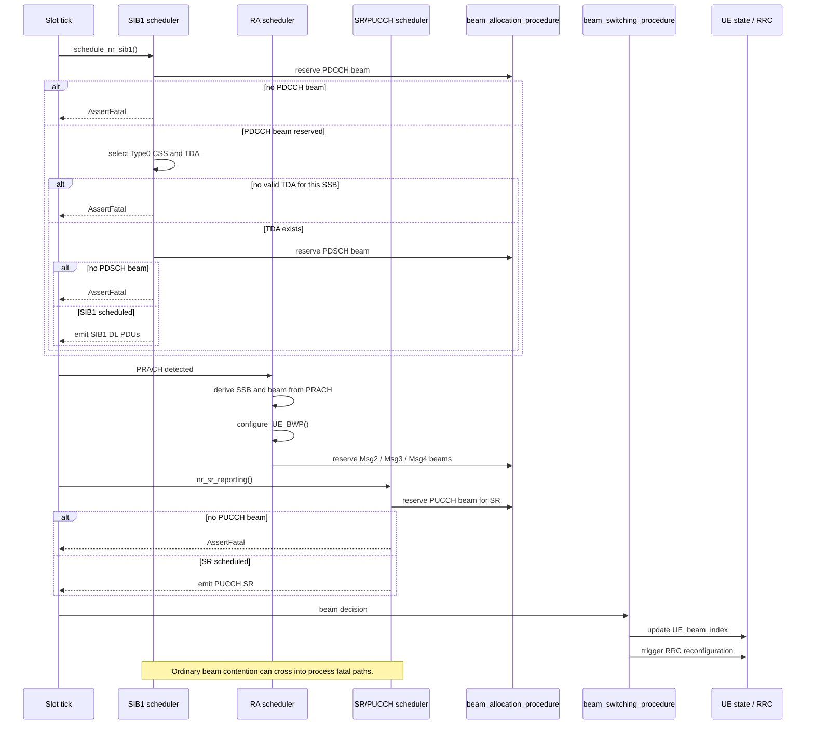
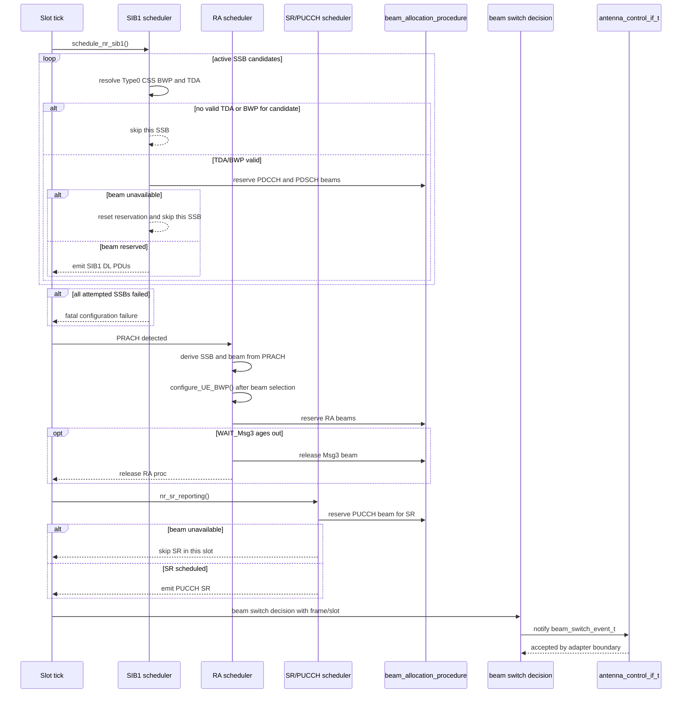
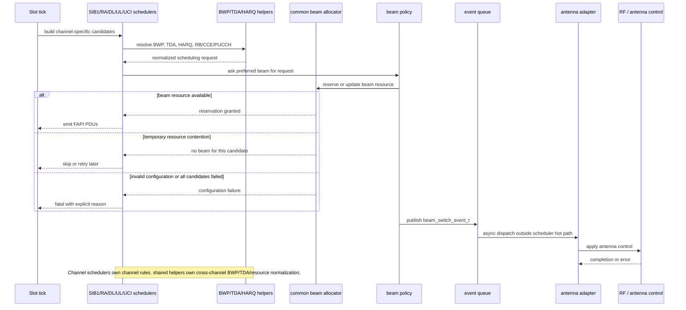

# シンボル単位ビームスケジューラの変遷とRFsim検証メモ

この資料は、以下の3点を整理するための開発メモである。

* `8259d8e459da46ea86a54090c0975c94b1a66c02` を開発起点としたとき、`4c6eece66cacdac73147b950b5d262dc2e45fd85` と `15063279788d6f14f8367a96008f431d26330a25` でMAC schedulerの振る舞いがどう変わったか。
* 特に `4c6eece6` から `15063279` にかけて、何がscheduler側のバグまたは不足だったのか。
* 何がRFsimだけに閉じた検証用の仕組みで、USRPなどの実機に移すときに何を置き換える必要があるか。

[[_TOC_]]

## 結論

`4c6eece6` は、上流で試作されていたシンボル単位ビームスケジューラを開発ベースへ移植し、MAC schedulerがビームごとのシンボル資源を管理する段階まで進めたコミットである。この時点で、PDCCH/PDSCH/PUCCH/PUSCH/SIB1/RAは `beam_allocation_procedure()` を通じて同一slot内のbeam resourceを取り合うようになった。

一方で、`4c6eece6` の実装は「移植された資源モデル」としては成立していても、FR2 64SSBのSA RFsim統合シナリオで必要になる防御が不足していた。具体的には、一部SSBでSIB1 TDAが取れないケース、RA時にUE beamが決まる前にBWPを構成するケース、PUCCH/SRのbeam allocation失敗をfatalにするケースなどが残っていた。

`15063279` は、64SSB + SA + RFsim上の簡易チャネル変動で、gNB/UEを落とさずRA完了とビーム切替スケジューリングへ到達するための補正を入れた段階である。scheduler本体の修正と、RFsimでチャネル状態を人工的に変えるための仕組みが同じ到達点に含まれているため、実機移行時には両者を分けて扱う必要がある。

## コミット系列の位置づけ

| Commit | 位置づけ | スケジューラ上の意味 | RFsim上の意味 | 残った前提 |
|---|---|---|---|---|
| `8259d8e` | 開発起点。OpenAirInterface 5G `2026.w07` をベースに、AllbesmartがO-DU端末向けにカスタムしたもの。 | 既存OAI schedulerの挙動をベースにする。MAC schedulerの中心責務はPF scheduling、RA、SIB1、UCIなどの通常資源割当であり、ビームごとのシンボル資源競合は主要な抽象として扱っていない。 | RFsimは通常の接続・チャネルモデル検証用。64SSBのビーム切替刺激を作る専用経路はない。 | 実機/O-DU向けの開発ベースであり、今回のビーム切替検証用の前提はまだ入っていない。 |
| `4c6eece6` | OAI upstreamで試作していたMAC層シンボル単位ビームスケジューラを半機械的に移植したもの。 | `NR_beam_info_t`、beam period、beam duration、per-beam VRB map、`beam_allocation_procedure()` などにより、schedulerがbeam resourceを明示的に予約するようになる。 | FR1 RFsim向けのbeam-symbol設定と単体/統合テストの土台が入る。 | 上流試作の前提が残り、64SSB SAでのSIB1/RA/PUCCH失敗を通常運用として扱う防御が不足している。 |
| `15063279` | RFSIM上で64SSB定義および簡易チャネル変動に伴うビーム切替スケジューリングを達成したもの。 | SIB1、RA、SR、PUCCH、CSI/TCI timerの各経路で、64SSBとsymbol-level beam allocationに耐えるための修正が入る。`UE_beam_index` 更新時に `antenna_control_if_t` へ通知できる。 | `chmod_file`、`rfsimu setpathloss`、`beam_gains`、`tx_beam_gains`、RFsim beam read/write補正により、チャネル変動とビーム切替をRFsim内で注入できる。 | RFsimの刺激生成は実機RF制御ではない。USRP/RUでは実アンテナ制御API、測定環境、beam ID伝搬の確認が別途必要になる。 |

## スケジューラ挙動の変化

### `8259d8e` 時点

開発起点では、MAC schedulerはOAIの既存設計に従い、slot内のRB、HARQ、RA、SIB1、PUCCH/PUSCHなどを処理する。beam IDやprecoding情報は存在していても、scheduler全体が「同じslot内のどのシンボルでどのbeamを使うか」を中心に資源競合を管理する構造ではない。

したがって、あるslot内でSIB1のPDCCH/PDSCH、RA Msg2/Msg4、UE-specific DLSCH、SR/PUCCHが異なるbeamを必要とする場合、それらが同時に成立するかどうかはschedulerの独立した資源モデルとしては明示されていなかった。

### `4c6eece6` 時点

`4c6eece6` では、MAC schedulerにsymbol-level beam resource modelが入る。中心になる考え方は、slotをbeam schedulingの単位へ分割し、各beam periodで使用可能なbeamを予約してからPDCCH/PDSCH/PUCCH/PUSCHを置くことである。

主な変化は以下である。

* `NR_beam_info_t` が、beam mode、beam duration、beams per period、beam allocation mapを持つ。
* `beam_allocation_procedure()` が、指定されたframe/slot/symbol範囲に対し、対象beamを置けるbeam structure indexを探す。
* `reset_beam_status()` が、後続の資源確保失敗時に一度予約したbeam allocationを戻す。
* DLSCH、ULSCH、RA、BCH/SIB1、UCI、SRSなどのscheduler経路が、RBだけでなくbeam allocationにも失敗し得るようになる。
* `convert_to_fapi_beam()` により、MAC側beam indexをFAPI beam indexへ変換する経路が入る。

この段階でschedulerの責務は大きく変わった。従来の「slot/RB/PUCCH occasionが空いているか」に加えて、「そのsymbol範囲で該当beamを送受信できるか」もMAC schedulerの成否条件になった。

ただし、この移植段階では、失敗をすべてfatalにしてよいという前提が残っていた。FR2 64SSBでは、SSB indexごとにType0 CSS、CORESET#0、SIB1 TDAの成立性が異なり得るため、一部SSBでSIB1を送れないことは必ずしもgNB全体の異常ではない。この点が `15063279` までの主な補正対象になった。

### `15063279` 時点

`15063279` では、64SSB SA RFsim統合テストで実際に落ちた箇所を中心に、schedulerの失敗条件が整理された。

`schedule_nr_sib1()` は、あるSSBについてSIB1 TDAやPDSCH beam allocationが取れない場合、そのSSBだけをskipするようになった。skip時には `ssb_index`、slot、CORESET start/duration、mux patternなどを `LOG_W` で残し、全active SSBで1件もSIB1を送れない場合だけfatalにする。

RAでは、`nr_initiate_ra_proc()` 内でPRACHからSSB indexを求め、`UE->UE_beam_index` を決めてから `configure_UE_BWP()` を呼ぶようになった。RA PDCCH monitoringがper-SSB Type0 CSS configに依存し得るため、BWP構成より先にUE beamを確定させる必要がある。

SR/PUCCH経路では、PUCCH用beam allocationが取れない場合にgNBを落とさず、そのSR occasionをskipする。symbol-level beam allocationでは、PUCCHが常に置けるとは限らないため、これは資源競合として扱うべき状態である。

CSI reportまたはTCI timer経由のbeam selectionでは、`UE_beam_index` を更新するだけでなく、`beam_switch_event_t` を `antenna_control_if_t` へ同期通知できるようになった。これにより、MAC schedulerのbeam decisionを実アンテナ制御へ接続するための境界ができた。

UE側では、CellGroupConfig直後にUL BWPやPUCCH common configが未設定の場合でも `nr_ue_configure_pucch()` がNULL dereferenceで落ちないようになった。これはscheduler本体というより、SA統合テストを進めるためのUE MAC側の防御である。

## `4c6eece6` から `15063279` にかけて修正されたバグ

下表は `4c6eece6` から `15063279` にかけて実際に修正された問題の一覧である。続く子節では、これらが参照元 `beam_symbol_switch_2026_w15` にも残っていた問題なのか、移植しきれていなかった問題なのかを切り分け、scheduler 構成としてどの責務が過剰に結合しているかを整理する。

| 領域 | `4c6eece6` 時点の症状 | 原因 | `15063279` での修正 | RFsim依存か |
|---|---|---|---|---|
| SIB1 TDA選択 | 64SSB構成で一部SSBのSIB1 TDAが取れないと `AssertFatal("Couldn't select any TDA for SIB1")` 相当でgNB全体が停止する。 | すべてのactive SSBでSIB1 TDAが必ず成立するという前提が残っていた。FR2 64SSBではType0 CSS/CORESET#0/mux patternにより、一部SSBのSIB1がそのslotで成立しないことがある。 | `schedule_nr_sib1()` で該当SSBだけを `LOG_W` してskipする。skip前にbeam allocationをresetし、active SSB全体で1件もSIB1を送れない場合だけfatalにする。 | いいえ。RFsimで顕在化したが、64SSBのscheduler防御として実機でも必要。 |
| SIB1 BWP/RIV | SI-RNTIのPDCCH/PDSCHやDCI frequency domain assignmentが、Type0 CSSのBWPではなくglobalなCSET0/initial BWP前提で計算される箇所があった。 | SIB1 schedulingでper-SSB Type0 CSS configを使う箇所と、global `cset0_bwp_size`/`cset0_bwp_start` を使う箇所が混在していた。 | `set_pdcch_structure()`、`check_sib1_tda()`、`nr_fill_nfapi_dl_SIB_pdu()` などで `type0_PDCCH_CSS_config->num_rbs` と `cset_start_rb` を使う。DCIのRIV計算もSI-RNTI/RA-RNTIの対象BWPに合わせる。 | いいえ。RFsimだけでなく、per-SSB Type0 CSSを使う実機設定でも必要。 |
| RA BWP構成順序 | RA手順でMsg2/Msg4のPDCCH/PDSCH allocationが期待するbeam/CSSとずれ、RAが進まない。 | `nr_initiate_ra_proc()` で、PRACHからUEが同期したSSB/beamを求める前に `configure_UE_BWP()` が走ると、RA PDCCH monitoringに必要なper-SSB情報を反映できない。 | PRACHから `n_ssb` を求め、`UE->UE_beam_index = get_beam_from_ssbidx(...)` を設定した後に `configure_UE_BWP()` を呼ぶ。 | いいえ。RA beamとType0 CSSの対応は実機でも重要。 |
| SR/PUCCH beam allocation | SR scheduling中にPUCCH用beamが取れないとfatalまたは強いエラー扱いになり、gNBが不安定になる。 | symbol-level beam allocationではPUCCHのsymbol範囲もbeam resourceを消費するが、移植直後は「置けないこと」を通常の資源競合として扱えていなかった。 | `nr_sr_reporting()` でbeam allocation失敗時は `LOG_D` して該当SRをskipする。確保済みbeam/RBがある場合はresetして次の機会に回す。 | いいえ。beam数に制限がある実機でも起こり得る。 |
| Beam switch通知 | CSI/TCIにより `UE_beam_index` が変わっても、外部のアンテナ制御へ構造化された通知が出ない。 | MAC schedulerのbeam decisionと実アンテナ制御の境界がなく、ログまたは内部状態更新に閉じていた。 | `beam_switch_event_t`、`beam_switch_notify_fn`、`antenna_control_if_t` を追加し、`beam_switching_procedure()` でold/new beam、RNTI、frame、slotを通知する。 | いいえ。RFsimではログ確認に使うが、実機ではRU/USRP制御へ接続する入口になる。 |
| TCI timer経路の時刻情報 | TCI timer満了によるbeam switchで、eventにframe/slotを載せられない。 | `beam_switching_procedure()` がUEとnew beamだけを受け取る設計だった。 | `beam_selection_procedures()` と `beam_switching_procedure()` にframe/slotを伝搬し、timer経路でも同じeventを出す。 | いいえ。実アンテナ制御では切替時刻の手掛かりになる。 |
| UE PUCCH config | SA統合中、CellGroupConfig直後にUE MACが `current_UL_BWP->pucch_ConfigCommon->pucch_ResourceCommon` を参照して落ちる。 | UE側のUL BWPまたはPUCCH common configがまだ揃っていないタイミングを想定していなかった。 | `nr_ue_configure_pucch()` とUCI on PUSCH側にNULL guardを追加し、未設定なら警告してskipする。 | RFsim限定ではないが、今回のRFsim SA統合で顕在化した。根治には実機でも設定適用順序の確認が必要。 |
| RFsim beam read/write | beam switching scenario中にRFsimの送受信beam状態やtimestamp処理が不安定になり、チャネル変動の効果を安定して再現できない。 | RFsimのbeam state参照、single-beam write、socket packet overlap処理が、今回のbeam switching用途に対して不足していた。 | RFsim内のbeam read/write、packet overlap、beam map/gain処理を補正する。 | はい。MAC schedulerではなくRFsim検証環境の問題。 |
| チャネル変動注入 | Telnet注入では統合テストでBroken pipeやstdin空コマンドのノイズが出やすく、主経路にするには脆い。 | テストの刺激生成がTelnet I/Fに依存していた。 | ChMod high-level APIと `chmod_file` pollingを追加し、テストスクリプトはファイルをatomicに更新してpathloss/gainを変える。 | はい。RFsim用の刺激生成であり、実機RF制御ではない。 |

### 参照元 `beam_symbol_switch_2026_w15` との照合
参照元 `beam_symbol_switch_2026_w15` は `2026.w15` 上の実験的実装であり、今回の移植後修正がすべて移植漏れだったわけではない。ここでは隣接ツリー `../beam_symbol_switch_2026_w15` の HEAD `4761812412` を基準に、`4c6eece6` 時点の移植直後実装と `15063279` 以降の修正内容を照合する。

| 領域 | 参照元での状態 | `4c6eece6` 時点の状態 | 判定 | 現在の整理 |
|---|---|---|---|---|
| SIB1 TDA / PDSCH beam 失敗 | `schedule_nr_sib1()` が SSB ごとに TDA と beam を選ぶが、TDA 不成立や SIB1 beam 不足を `AssertFatal()` で扱う。 | 参照元と同様に、一部 SSB の不成立が gNB 全体の fatal になりうる。 | 参照元由来 | `15063279` では SSB 単位で skip し、送信候補が全滅した場合だけ fatal とする整理に変更した。 |
| SIB1 BWP/RIV | 参照元にも global `cset0_bwp_size` と initial BWP 前提が残り、Type0 CSS の BWP と完全には分離されていない。 | Type0 CSS 対応を移植したが、RIV/DCI 幅の一部に initial BWP 前提が残った。 | 参照元由来 + 移植後調整不足 | Type0 CSS の `cset_start_rb` / `num_rbs` を使うように寄せ、SIB1 用 PDSCH/PDCCH BWP の局所不整合を解消した。 |
| RA BWP 構成順序 | PRACH 由来の SSB index から `UE_beam_index` を決めたあとに `configure_UE_BWP()` を呼ぶ。 | `configure_UE_BWP()` が beam 決定より前に呼ばれ、RA 用 BWP が同期 SSB/beam を見られない。 | 移植漏れ | 参照元の正しい順序に戻し、PRACH 由来 beam を RA context に反映してから BWP を構成する。 |
| `ssb_per_rach_occasion` の sixteen 対応 | 配列定義が `0.125` から `8` までで、`16` に対応する要素がない。 | 参照元と同じく `16` が未定義。境界条件で SSB index 計算が壊れる。 | 参照元由来 | `16` を明示的に追加し、設定値が sixteen の場合でも PRACH から SSB を決められるようにした。 |
| Msg3 未受信時の beam 解放 / RA release | WAIT_Msg3 が長く残った場合に、予約済み Msg3 beam を aging で解放する防御がない。 | 同様に RA proc が残り続け、後続 RA/SR/SIB1 の beam 競合を誘発しうる。 | 参照元由来の運用防御不足 | WAIT_Msg3 の経過 slot を見て RA proc を release し、`Msg3_beam` も reset する。 |
| SR / PUCCH beam allocation 失敗 | `nr_sr_reporting()` が SR 用 PUCCH beam 不足を `AssertFatal()` として扱う。 | 同様に SR の一時的な beam 競合で gNB が停止しうる。 | 参照元由来 | SR は UCI/PUCCH scheduling の資源競合として skip し、次 slot 以降の retry に委ねる。 |
| Beam switch 通知と frame/slot 伝搬 | beam switch は `UE_beam_index` 更新と RRC reconfiguration trigger に閉じており、外部 antenna control event や frame/slot 情報はない。 | RRC reconfiguration trigger も持たず、内部 beam index 更新に近い形で移植されていた。 | 新規要求 / 設計差分 + 移植差分 | `beam_switch_event_t` に frame/slot と old/new beam を持たせ、`antenna_control_if_t` に通知する境界を追加した。 |

この照合から、明確な移植漏れと言えるのは RA BWP 構成順序である。一方で、SIB1/SR の fatal、`ssb_per_rach_occasion` の `16` 欠落、Msg3 待ち RA proc の残留は参照元にも残っていた実験実装上の粗さであり、移植後の RFsim/USRP 検証で gNB 生存性の問題として顕在化したものと見なせる。

### 移植元・移植後修正・本来構成のスケジューラ比較
ここでは、参照元の実験的な流れ、`15063279` 以降の防御付き実装、本来あるべき責務分離の3段階を並べる。3つ目は今回実装した差分そのものではなく、調査から見えた scheduler 構成の整理案である。

#### 移植元 `beam_symbol_switch_2026_w15` の実験的な流れ

参照元では channel-specific scheduler が必要な場面で直接 `beam_allocation_procedure()` を呼び、beam が取れない場合は多くの経路で fatal または即 return になる。SIB1 scheduler は SSB ごとの Type0 CSS/TDA/beam を扱うが、一部 SSB の不成立を通常の scheduling miss として扱わない。RA scheduler は PRACH 由来 beam を BWP 構成前に決める点は正しいが、beam switch は `UE_beam_index` 更新と RRC reconfiguration trigger 寄りで、外部アンテナ制御との明示的な境界を持たない。



#### `15063279` 以降の防御付きの流れ

移植後修正では、SIB1 の候補 SSB 単位 skip、RA の beam 決定後 BWP 構成、SR の beam 不足 skip、beam switch event の外部通知を追加した。これにより、beam availability の一時的な不足を scheduler の通常の失敗として扱える範囲が広がった。



#### 本来あるべき scheduler 構成

本来の構成では、`beam_allocation_procedure()` は scheduler 共通の beam resource allocator として維持し、SIB1/RA/DL/UL/UCI scheduler はそれぞれの channel 仕様、TDA、HARQ、RB/CCE/PUCCH 選択に集中するのが望ましい。beam availability の不足は原則として「その候補を skip / retry」扱いにし、設定矛盾や全候補不成立だけを fatal とする。外部アンテナ制御は scheduler thread から重い I/O を直接実行せず、`antenna_control_if_t` を queue 投入または非同期 adapter の境界として扱う。



#### 責務侵害として見える点

- SIB1 scheduler が Type0 CSS/BWP/RIV 補正を局所的に抱えすぎている。共通の PDCCH/PDSCH BWP 解決 helper に寄せるのが望ましい。
- RA scheduler が beam 決定、BWP 構成、Msg2/Msg4 resource selection を強く結合している。RA context に同期 SSB/beam を保存し、BWP/PDCCH helper がそれを読む構成が望ましい。
- UCI/SR scheduler が beam 不足を fatal にすると、PUCCH scheduling の資源競合判定を越えて gNB 生存性を侵害する。
- beam switch 処理が RRC reconfiguration やアンテナ制御を直接実行する設計は危険である。scheduler の責務は decision/event 発行までに留め、重い I/O は非同期 adapter 側へ逃がすべきである。

## RFsimに関係している問題

### ChModとpathloss注入

`radio/rfsimulator/simulator.cpp` には、RFsim内部で `path_loss_dB` を変更するための経路が追加されている。

* Low-level APIは `channel_desc_t` の `path_loss_dB` を直接更新し、旧値を返す。
* High-level APIは `rfsimulator_state_t`、`model_name`、`path_loss_dB` を受け取り、active channelを探索して一致したチャネルを更新する。
* Telnet I/Fである `rfsimu setpathloss <model_name> <path_loss_dB>` は、parseと表示だけを担当する。
* `chmod_file` / `chmod_poll_ms` は、RFsimが周期的にファイルを読み、接続済みactive channelにpathlossを反映するための設定である。

これらはRFsim内のchannel modelを動かす仕組みであり、USRPや実RUで送信電力、伝搬損失、アンテナ方向を変えるAPIではない。

### `beam_gains` と `tx_beam_gains`

`beam_gains` と `tx_beam_gains` は、RFsim内でbeamごとの受信/送信利得差を簡易的に作るための検証用パラメータである。`run_beam_switch_test.sh` では、gNB側のChMod fileにpathlossと `tx_beam_gains` を書き込み、UEが観測するSSB/beam RSRPの優劣が変わるようにしている。

この仕組みは、MAC schedulerがCSI reportを見て `beam_selection_procedures()` を呼び、`UE_beam_index` を切り替えるまでの経路をRFsimで再現するためのものである。実機では、同じことをRFsim sample scalingではなく、実アンテナのbeam weight、RU制御、移動環境、可変attenuator、または測定環境で再現する必要がある。

### RFsim socket処理

RFsimのsocket buffer、timestamp overlap、beam read/write処理の補正は、今回の統合テストを安定させるために重要だった。特に、beamごとに送信区間が分かれると、単純なsingle-buffer writeや過去timestamp packetの扱いがテストの成否に影響する。

ただし、これはRFsim transportの整合性問題であり、MAC schedulerの正しさそのものではない。実機移行時には、RFsim socketの補正を持ち込むのではなく、RU/PHY/FAPI経路がbeam IDと送受信タイミングをどう扱うかを別途確認する。

### 統合テストスクリプトとFR2 64SSB設定

`openair2/LAYER2/NR_MAC_gNB/tests/run_beam_switch_test.sh` と `ci-scripts/conf_files/gnb.sa.band257.u3.66prb.rfsim.beam-symbol.conf` は、RFsimで64SSB、analog beamforming、ChMod file polling、beam gain変動を組み合わせるためのテスト環境である。

このテストは、schedulerが以下の流れに到達できるかを確認するためのものとして読むべきである。

1. 64SSB構成でgNBがSIB1 schedulingを継続できる。
2. UEがRAを完了できる。
3. RFsim内のpathloss/gain変動によりCSI/SSB RSRPの優劣が変わる。
4. MAC schedulerがbeam switchを判断し、`Switching to beam` または `[AntennaCtrl] Beam switch` を出す。

## USRPなど実機移行時の注意

この章でいう実機移行は、RFsimをUSRPへ置き換えるだけの話ではない。想定する実験系はOTAであり、PC、USRP、アレイアンテナモジュールが協調して動作すること自体は既に成立している前提である。

今回のミソは、その既存のOTA制御系を、今回追加したMAC schedulerのbeam decisionと `antenna_control_if_t` に接続することである。RFsimでは `pathloss` や `tx_beam_gains` を人工的に変えてbeam switchを誘発したが、実機ではUEがOTAで観測するSSB/CSIの変化と、アレイアンテナモジュールへ投入するbeam table/位相設定が実際の制御対象になる。

### そのまま維持すべき部分

以下はRFsimだけの回避ではなく、OTAでも必要なMAC decisionの安定化として維持すべき修正である。実機ではRFsimよりも測定遅延、RF制御遅延、OTAチャネル変動が大きくなるため、schedulerが「一部の資源が置けない」状態でgNB全体を落とさないことがより重要になる。

* 64SSB時に一部SSBのSIB1 TDA失敗をgNB全体のfatalにしない防御。
* SIB1/RA/SI-RNTI/RA-RNTIのBWP size/start/RIVを対象BWPに合わせる修正。
* RA開始時にPRACH由来のSSB/beamを決めてからUE BWPを構成する順序。
* SR/PUCCH用beam allocation失敗を通常の資源競合として扱う修正。
* `UE_beam_index` 更新を `antenna_control_if_t` へ通知する境界。

これらは、RFsimで顕在化したとしても、実機の64SSB/analog beamforming構成でも維持すべきである。特に `antenna_control_if_t` は、MACが選んだ `new_beam_index` をPC側のアンテナ制御プロセスへ渡すための最小境界として扱う。

### 置き換えが必要な部分

以下はRFsim検証用の仕組みであり、OTA実機では置き換えが必要である。

* `chmod_file` pollingによるpathloss変更。
* `rfsimu setpathloss` によるchannel model操作。
* `beam_gains` / `tx_beam_gains` によるsample scaling。
* `run_beam_switch_test.sh` のRFsim ChMod file注入シナリオ。

実機では、これらをアレイアンテナモジュール制御、USRP RF経路、OTAで実際に発生するチャネル変動へ置き換える。つまり、`path_loss_dB` をファイルで書き換えるのではなく、UEがOTAで観測するSSB/CSIの変化を入力にし、MACが選んだbeamをアレイアンテナモジュールのbeam tableまたは位相設定へ反映する。

`antenna_control_if_t` のdefault loggerは実機制御ではない。実機では `on_beam_switch` の実装を差し替え、`beam_switch_event_t.new_beam_index` をPC側のアンテナ制御コマンドへ変換する必要がある。USRP自体はRF sampleの送受信経路を担い、beam方向の実制御はアレイアンテナモジュール側の既存制御APIに接続する、という責務分担で整理する。

### 追加確認が必要な部分

実機移行時には、少なくとも以下を確認する。焦点は、MAC schedulerの判断をOTA制御系へ安全に渡す接続点である。

* `antenna_control_if_t.on_beam_switch` を、PC上のアレイアンテナ制御プロセスへ接続する。scheduler thread内で同期的に呼ばれるため、callback内でUSB/serial/socket I/Oを直接待たず、制御要求をqueueへ積んで別thread/processで処理する。
* `beam_switch_event_t.new_beam_index` とアレイアンテナモジュールのbeam tableを1対1または変換表で対応させる。MACのbeam index、FAPI beam ID、アンテナモジュールのbeam番号が同じとは限らないため、対応表を明示的に持つ。
* `event.frame` / `event.slot` と実アンテナ制御の反映時刻をログで相関できるようにする。OTAでは制御遅延があるため、「schedulerが決めたslot」と「アンテナが実際に切り替わった時刻」を分けて観測する。
* MACが設定するFAPI beam IDをPHY/RUが実際に消費しているかを確認する。ログ上のbeam switchだけでは、RFが向いているとは限らない。
* `LOPHY_BEAM_IDX` と通常beam indexの扱いが、対象USRP/RU構成のFAPI実装と一致するかを確認する。
* 64SSB、CORESET#0、searchSpaceZero、SIB1 TDAが、対象band/numerology/SSB bitmapで妥当かを確認する。
* RFsimの簡易gain変動で得たCSI/SSB RSRP変化と、実機UEが報告する測定周期、filtering、CSI report timingが一致しない可能性を前提に評価する。
* UE PUCCH guardはクラッシュ回避であり、実機運用ではPUCCH common configがいつ有効になるべきかを別途確認する。

### 過度に手を入れた可能性がある部分

今回の到達点では、統合テストを進めるためにRFsim側へ多くの刺激生成機構を追加している。特に `tx_beam_gains` は、UE側のChMod pollingを避けつつgNB側から見える送信beam差を作るための検証支援である。

この設計はRFsimテストとしては有用だが、実機制御抽象として拡張すべきではない。OTA実機では、sample scalingでbeam差を作るのではなく、既存のPC/USRP/アレイアンテナモジュール協調系を使って、実アンテナのbeam tableまたは位相設定を切り替える。

また、`create_default_antenna_ctrl()` が提供するdefault loggerは、実機制御が接続されたことを意味しない。実機用には、MAC schedulerのdecisionである `beam_switch_event_t` と、アレイアンテナモジュールが消費するbeam control commandを結ぶadapterを別途実装する必要がある。このadapterは、scheduler threadをblockしないこと、beam index変換を明示すること、制御遅延をログで追跡できることを最低条件にする。

## 検証と根拠

この資料の根拠にした主な確認範囲は以下である。

```bash
git diff 8259d8e459da46ea86a54090c0975c94b1a66c02..4c6eece66cacdac73147b950b5d262dc2e45fd85
git diff 4c6eece66cacdac73147b950b5d262dc2e45fd85..15063279788d6f14f8367a96008f431d26330a25
git log --reverse 4c6eece66cacdac73147b950b5d262dc2e45fd85..15063279788d6f14f8367a96008f431d26330a25
```

主な参照ファイルは以下である。

* [`gNB_scheduler_bch.c`](../../openair2/LAYER2/NR_MAC_gNB/gNB_scheduler_bch.c): SIB1 TDA、Type0 CSS、SIB1 skip防御。
* [`gNB_scheduler_RA.c`](../../openair2/LAYER2/NR_MAC_gNB/gNB_scheduler_RA.c): RA開始時のSSB/beam決定、Msg2/Msg4 scheduling。
* [`gNB_scheduler_primitives.c`](../../openair2/LAYER2/NR_MAC_gNB/gNB_scheduler_primitives.c): beam allocation、FAPI beam変換、DCI RIV、beam selection。
* [`gNB_scheduler_uci.c`](../../openair2/LAYER2/NR_MAC_gNB/gNB_scheduler_uci.c): CSI reportからのbeam selection、SR/PUCCH scheduling。
* [`beam_antenna_control.h`](../../openair2/LAYER2/NR_MAC_gNB/beam_antenna_control.h): antenna control callback境界。
* [`nr_ue_procedures.c`](../../openair2/LAYER2/NR_MAC_UE/nr_ue_procedures.c): UE PUCCH config guard。
* [`simulator.cpp`](../../radio/rfsimulator/simulator.cpp): RFsim ChMod、beam gains、pathloss、socket/beam処理。
* [`run_beam_switch_test.sh`](../../openair2/LAYER2/NR_MAC_gNB/tests/run_beam_switch_test.sh): RFsim統合テストの刺激生成。

凍結済みTDDテストとしては、以下の性質を固定している。

* `test_antenna_control.c`: default antenna control callbackとdestroy安全性。
* `test_beam_selection.c`: `UE_beam_index` 更新、old/new beam event、frame/slot伝搬、no-op条件。
* `test_beam_symbol_alloc.c`: beam allocationとresetの基本挙動。

RFsim統合テストでは、gNBログで以下を確認する。

* `Skipping SIB1 for SSB ... no valid TDA` が出てもgNBが継続する。
* `path_loss_dB: ... for channel 'rfsimu_channel_ue0'` または `tx_beam_gains: ...` がChMod fileから反映される。
* RA完了後、`Switching to beam` または `[AntennaCtrl] Beam switch` が出る。
* Telnet `Broken pipe` やstdin空コマンドにテスト成否が依存しない。

## Appendix: `mdsplit` での保守手順

この資料は、`mdsplit` の分解成果物を原本として管理する。単一Markdownの `doc/MAC/symbol_beam_scheduler_evolution.md` は、原本から再構成した表示・レビュー用の成果物である。

```bash
mdsplit verify doc/MAC/symbol_beam_scheduler_evolution/hierarchy.json
mdsplit compose doc/MAC/symbol_beam_scheduler_evolution/hierarchy.json -o doc/MAC/symbol_beam_scheduler_evolution.md
```

`doc/MAC/symbol_beam_scheduler_evolution/sections/` 以下では、章ごとにMarkdownを確認できる。`hierarchy.json` には見出し階層、section file、順序がJSONとして保存される。本文を編集する場合は原則としてsection fileを更新し、`mdsplit compose` で単一Markdownへ反映する。

compose結果を確認するだけなら、以下のように `/tmp` へ出力して差分を見る。

```bash
mdsplit compose doc/MAC/symbol_beam_scheduler_evolution/hierarchy.json -o /tmp/symbol_beam_scheduler_evolution.md
diff -u /tmp/symbol_beam_scheduler_evolution.md doc/MAC/symbol_beam_scheduler_evolution.md
```

分解原本と単一Markdownのどちらか一方だけを変更すると内容がずれるため、レビュー時には両方が同じ内容を表していることを確認する。
