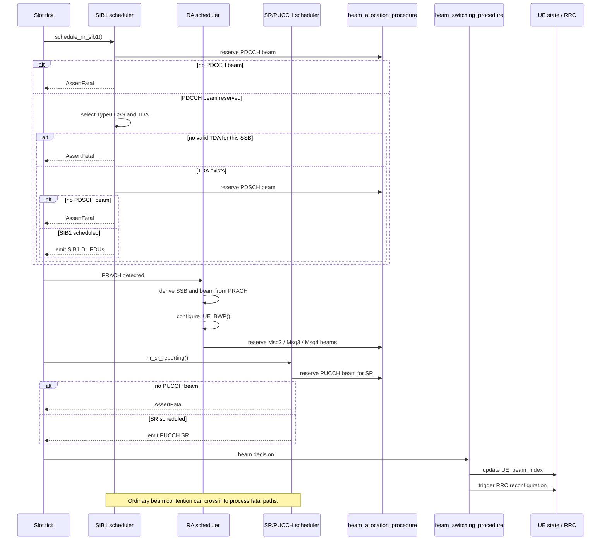
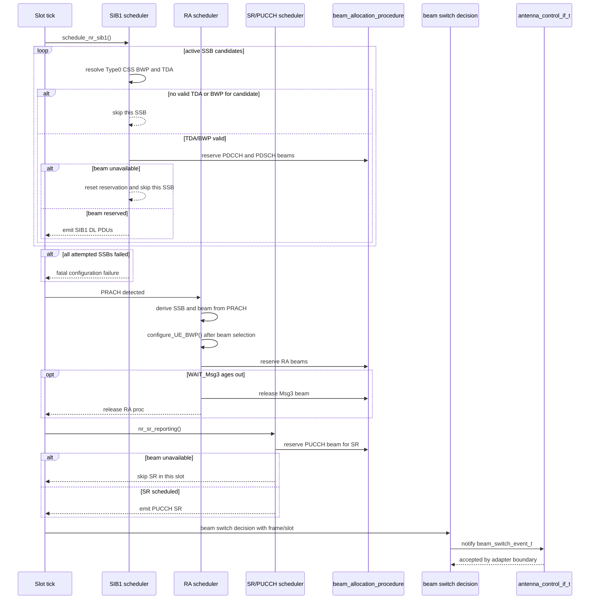
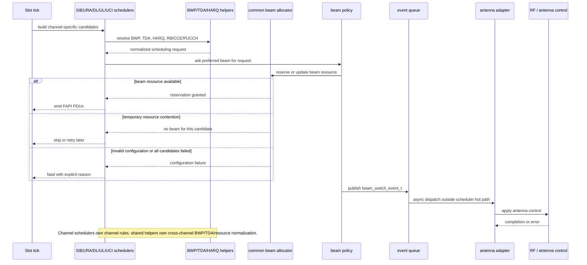

ここでは、参照元の実験的な流れ、`15063279` 以降の防御付き実装、本来あるべき責務分離の3段階を並べる。3つ目は今回実装した差分そのものではなく、調査から見えた scheduler 構成の整理案である。

#### 移植元 `beam_symbol_switch_2026_w15` の実験的な流れ

参照元では channel-specific scheduler が必要な場面で直接 `beam_allocation_procedure()` を呼び、beam が取れない場合は多くの経路で fatal または即 return になる。SIB1 scheduler は SSB ごとの Type0 CSS/TDA/beam を扱うが、一部 SSB の不成立を通常の scheduling miss として扱わない。RA scheduler は PRACH 由来 beam を BWP 構成前に決める点は正しいが、beam switch は `UE_beam_index` 更新と RRC reconfiguration trigger 寄りで、外部アンテナ制御との明示的な境界を持たない。

#### `15063279` 以降の防御付きの流れ

移植後修正では、SIB1 の候補 SSB 単位 skip、RA の beam 決定後 BWP 構成、SR の beam 不足 skip、beam switch event の外部通知を追加した。これにより、beam availability の一時的な不足を scheduler の通常の失敗として扱える範囲が広がった。

#### 本来あるべき scheduler 構成

本来の構成では、`beam_allocation_procedure()` は scheduler 共通の beam resource allocator として維持し、SIB1/RA/DL/UL/UCI scheduler はそれぞれの channel 仕様、TDA、HARQ、RB/CCE/PUCCH 選択に集中するのが望ましい。beam availability の不足は原則として「その候補を skip / retry」扱いにし、設定矛盾や全候補不成立だけを fatal とする。外部アンテナ制御は scheduler thread から重い I/O を直接実行せず、`antenna_control_if_t` を queue 投入または非同期 adapter の境界として扱う。

#### 責務侵害として見える点

- SIB1 scheduler が Type0 CSS/BWP/RIV 補正を局所的に抱えすぎている。共通の PDCCH/PDSCH BWP 解決 helper に寄せるのが望ましい。
- RA scheduler が beam 決定、BWP 構成、Msg2/Msg4 resource selection を強く結合している。RA context に同期 SSB/beam を保存し、BWP/PDCCH helper がそれを読む構成が望ましい。
- UCI/SR scheduler が beam 不足を fatal にすると、PUCCH scheduling の資源競合判定を越えて gNB 生存性を侵害する。
- beam switch 処理が RRC reconfiguration やアンテナ制御を直接実行する設計は危険である。scheduler の責務は decision/event 発行までに留め、重い I/O は非同期 adapter 側へ逃がすべきである。
